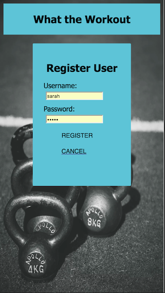
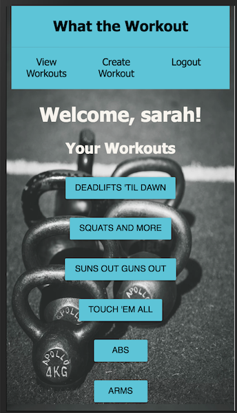
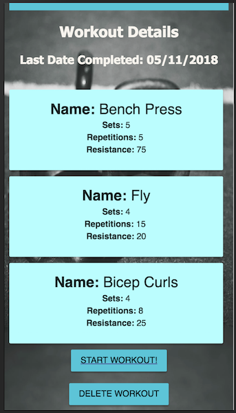
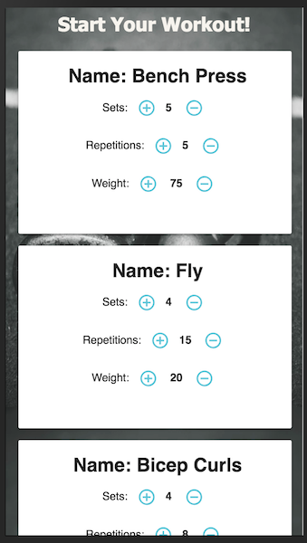
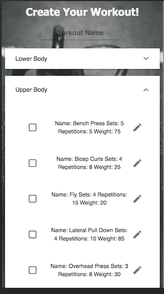
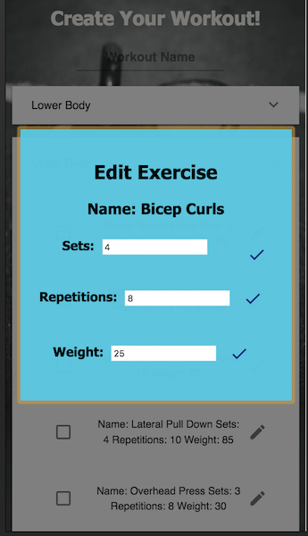

# What The Workout
This is my Solo Full Stack Application completed in May 2018 while a student at Prime Digital Academy. It was created with React using reducers and sagas, SQL, Express, and Node.js. 

This application allows a user to create and complete a workout. Upon going to the landing page, a user will be prompted to login or create a new account. Once the user is logged in they will see a list of all created workouts.

   

The user can select a workout to see more details - including the exercises, default weights, sets, and repetitions (reps). The user is able to start the workout or delete the workout. If the user chooses to delete the workout, a dialog box will prompt the user to confirm deletion before the workout and associated sessions are deleted.




Once a user starts the workout, each workout will appear individually on the screen. The default sets, reps, and weight will be displayed. The user is able to increase and decrease the default settings by user the add and subtract buttons. When the user has completed the workout, clicking “Finished Workout” will save the session and completed exercises to the database. The next time the user views the workout, the most recent completed sets, reps, and weight will display as the defaults. 



The user can create a new workout by clicking “Create Workout”. This screen displays two expansion panels, “Lower Body” and “Upper Body.” The user is able to select specific exercises, and they are able to change default settings by clicking the Edit button. This allows the user to update the sets, reps, and weight. These are individually edited on the Edit Exercise modal.

   

## Technologies Used

This application was created with the following:
* React
* React-Redux
* Node.js
* Express
* SQL
* Passport
* Material UI
* Moment.js

## Setup Instructions

* Run `npm install`
* Run `npm run server`
* Run `npm run client`
* You should be automatically directed to `localhost:3000`. If not, navigate to `localhost:3000`.

## To Create the Database and Tables with PostgreSQL

Create a new database called `petHotel` and two tables: `pet` and `owner`. 

```SQL
CREATE SCHEMA "workoutApp";

CREATE TABLE "workoutApp"."person" (
    "id" SERIAL PRIMARY KEY,
    "username" VARCHAR (80) UNIQUE NOT NULL,
    "password" VARCHAR (100) NOT NULL
);

CREATE TABLE "workoutApp"."workout" (
  "id" SERIAL PRIMARY KEY,
  "name" VARCHAR(60) NOT NULL,
  "user_id" INT REFERENCES "workoutApp"."person" (id)
);

CREATE TABLE "workoutApp"."exercise" (
  "id" SERIAL PRIMARY KEY,
  "name" VARCHAR(50) NOT NULL,
  "default_sets" INT,
  "default_reps" VARCHAR(20),
  "default_weight" VARCHAR(20),
  "family" VARCHAR(30) NOT NULL
);

CREATE TABLE "workoutApp"."workout_detail" (
  "id" SERIAL PRIMARY KEY,
  "workout_id" INT REFERENCES "workoutApp"."workout" (id) ON DELETE CASCADE,
  "exercise_id" INT REFERENCES "workoutApp"."exercise" (id) ON DELETE CASCADE
);

CREATE TABLE "workoutApp"."session" (
  "id" SERIAL PRIMARY KEY,
  "user_id" INT NOT NULL,
  "workout_id" INT REFERENCES "workoutApp"."workout" (id) ON DELETE CASCADE,
  "date" DATE,
);

CREATE TABLE "workoutApp"."completed_exercise" (
  "id" SERIAL PRIMARY KEY,
  "session_id" INT REFERENCES "workoutApp"."session" (id) ON DELETE CASCADE,
  "exercise_id" INT REFERENCES "workoutApp"."exercise" (id) ON DELETE CASCADE,
  "completed_sets" INT,
  "completed_reps" VARCHAR(20),
  "completed_weights" VARCHAR(20),
  "completed?" BOOLEAN NOT NULL
);

INSERT INTO "workoutApp"."exercise" (name, default_sets, default_reps, default_weight, family)
VALUES
('Squats', 5, 5, 155, 'lower body'),
('Deadlift', 5, 5, 185, 'lower body'),
('Lunge', 10, 4, '20x20', 'lower body'),
('Straight Leg Deadlifts', 10, 4, 65, 'lower body'),
('Rows', 12, 3, 75, 'lower body'),
('Box Jump', 10, 3, '18"', 'lower body'),
('Good Mornings', 8, 5, 85, 'lower body'),
('Split Squat', 10, 4, '20x20', 'lower body'),
('Fly', 12, 4, '15x15', 'upper body'),
('Lateral Pull Down', 12, 3, 7, 'upper body'),
('Bicep Curls', 10, 4, '20x20', 'upper body'),
('Tricep Extensions', 10, 4, '10x10', 'upper body'),
('Bench Press', 5, 5, 85, 'upper body'),
('Overhead Press', 10, 4, '25x25', 'upper body');
```

